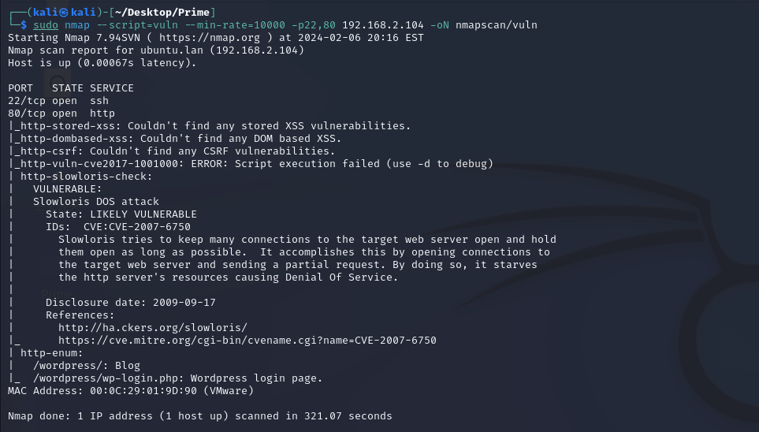

# Prime

## 1、nmap




## 2、web渗透

### 随便看看


### 首页隐写查看


### 目录爆破

#### gobuster


#### feroxbuster


#### dirsearch


#### dirb

只有dirb扫出来


### whatweb


### searchsploit WordPress 5.2.2

WordPress利用点基本上都是插件或者主题，这里暂时都不可用


### /dev


### /secret.txt


### Fuzz_For_Web


### wfuzz

尝试dirb跑出来的两个根目录下的php文件

#### image.php


#### index.php


### location.txt


### secrettier360


这里告诉我们找到了正确的参数，又没说要继续做什么，那么这里就要有一个思路，看看有没有本地文件包含。

### 文件包含漏洞


### 包含出password.txt


### 尝试ssh登入


### 尝试登入wordpress

刚刚发现有两个用户，saket加上获得的密码没法登入，使用victor用户加密码成功登入后台。或者使用wordpress扫描工具、仔细观察页面信息同样也可以发现有价值的东西。


### wordpress渗透

利用点基本上都是插件或者主题，这里以及成功进入后台，可以尝试这个思路。

#### wpscan


#### 插件尝试

先试试看看上传的zip包能否被执行。上传插件走不通


#### 主题尝试


#### 主题编辑器

靠经验去寻找有可写权限的文件


## 3、内网渗透

### 拿下系统shell

通过主题编辑器上的readme.txt文件，很容易就确认目录


### user.txt(flag)


### 计划任务


### 随便看看


### find查找备份文件

由于是个网站，可尝试找找备份文件


### 提权

#### /enc提权【难】

##### 简单尝试

enc目录有可写权限，又可执行无密码执行enc，可尝试提权。不过好像库里又不是enc，还待商榷。


##### backup_password

当一个东西执行完成后，发现没什么效果，那么这里就要有一个思路。文件为什么执行，执行之后有什么效果，会实现什么东西。最容易想到的就执行完成后在当前目录释放某些东西。


##### enc.txt/key.txt

看到enc、key这些关键字就要联想出openssl的对称加密算法中的enc


##### ↓密码问题↓【难】

###### 先记录到本地，慢慢破解


###### string "ippsec" into md5 hash(key)

注意这里-n参数表示的换行符一定要注意，有换行和没有换行的md5值是不同的，如果不是很清楚可以两种都去尝试。


###### md5 hash into hex(key)


###### 生成CipherTypes(用于遍历密钥类型字典)


###### 还差一步，遍历-CipherType


###### 写bash的for循环脚本

发现一个结果也没有，尝试把-n去掉


去掉-n后，就可以解出


###### 优化bash脚本

把使用哪种类型的加密类型给显示出来

```bash
# 最终脚本
$ for Cipher in $(cat CipherTypes);do echo 'nzE+iKr82Kh8BOQg0k/LViTZJup+9DReAsXd/PCtFZP5FHM7WtJ9Nz1NmqMi9G0i7rGIvhK2jRcGnFyWDT9MLoJvY1gZKI2xsUuS3nJ/n3T1Pe//4kKId+B3wfDW/TgqX6Hg/kUj8JO08wGe9JxtOEJ6XJA3cO/cSna9v3YVf/ssHTbXkb+bFgY7WLdHJyvF6lD/wfpY2ZnA1787ajtm+/aWWVMxDOwKuqIT1ZZ0Nw4=' | openssl enc -d -a -$Cipher -K 3336366137346362336339353964653137643631646233303539316333396431 2>/dev/null;echo $Cipher;done
```


##### 使用tribute_to_ippsec成功ssh登入saket用户


##### sudo -l


##### /tmp/challenge


#### 尝试内核提权【易】

##### 寻找漏洞


##### 查看使用方法

使用方法很简单，gcc编译加执行即可（靶机上也有gcc）


##### 下载45010.c

用户家目录下没法写文件，换到/tmp目录下写


##### 编译执行


### root.txt(flag)

